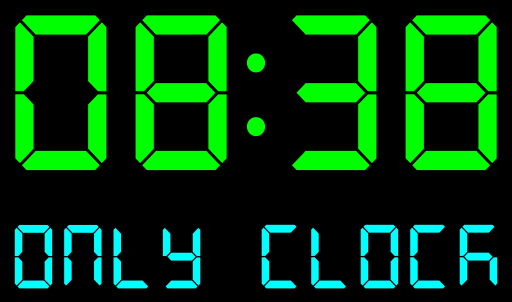

# OrrClock

<div align="center">
  
</div>

<div align="center">
  
[](https://opensource.org/licenses/MIT)
[](https://www.python.org/)
[](https://kivy.org/)
[](https://github.com/OrrStudio/OrrClock/releases)
[](https://github.com/OrrStudio/OrrClock/graphs/commit-activity)
[](https://github.com/OrrStudio/OrrClock/issues)

</div>

Un orologio digitale adattivo con un design moderno e minimalista, sviluppato utilizzando il framework Kivy.

[🇬🇧 English](../README.md) |  
[🇦🇿 Azərbaycan](README.az.md) |  
[🇹🇷 Türkçe](README.tr.md) |  
[🇸🇦 العربية](README.ar.md) |  
[🇮🇷 فارسی](README.fa.md) |  
[🇷🇺 Русский](README.ru.md) |  
[🇩🇪 Deutsch](README.de.md) |  
[🇪🇸 Español](README.es.md) |  
[🇫🇷 Français](README.fr.md) |  
[🇯🇵 日本語](README.ja.md) |  
[🇨🇳 中文](README.zh.md) |  
[🇮🇳 हिंदी](README.hi.md)

## Caratteristiche

- Adattamento automatico dell'interfaccia per l'orientamento verticale e orizzontale
- Animazioni fluide durante il cambio di orientamento e l'aggiornamento dell'ora
- Schema colori personalizzabile con 9 colori preimpostati
- Design minimalista con sfondo nero
- Prestazioni ottimizzate utilizzando l'isteresi per il rilevamento dell'orientamento

## Applicazioni e Capacità

OrrClock non è solo un orologio, è un'applicazione multifunzionale per la visualizzazione del tempo che può essere utilizzata in vari scenari:

### Uso Domestico
- Come orologio da scrivania sul computer o laptop
- Come orologio per presentazioni o riunioni online
- Come orologio a schermo intero per l'home theater

### Uso Professionale
- Negli studi televisivi per la visualizzazione dell'ora corrente
- Su display informativi in uffici e spazi pubblici
- Nelle istituzioni educative per il controllo del tempo

### Vantaggi
- Il design adattivo permette l'utilizzo dell'applicazione su schermi di qualsiasi orientamento
- Alta leggibilità grazie ai colori contrastanti e al design minimalista
- I colori personalizzabili permettono di adattare l'orologio a qualsiasi interno o stile aziendale

### Personalizzazione
L'applicazione è facilmente personalizzabile:
- Scelta degli schemi colore
- Adattamento alla modalità verticale o orizzontale

## Tecnologie

- Python 3
- Kivy 2.2.1
- Architettura modulare con separazione dei componenti UI

## Struttura del progetto

```
OrrClock/
├── main.py                 # File principale dell'applicazione
├── ui/                     # Componenti UI
│   ├── base_clock.py       # Classe base dell'orologio
│   ├── landscape_clock.py  # Orientamento orizzontale
│   ├── portrait_clock.py   # Orientamento verticale
│   └── settings_window.py  # Finestra impostazioni
├── data/                   # Dati aggiuntivi
├── fonts/                  # Font
└── requirements.txt        # Dipendenze
```

## Installazione

1. Clona il repository:
```bash
git clone https://github.com/OrrStudio/OrrClock.git
cd OrrClock
```

2. Crea e attiva l'ambiente virtuale:
```bash
python -m venv venv
source venv/bin/activate  # per Linux/Mac
```

3. Installa le dipendenze:
```bash
pip install -r requirements.txt
```

4. Avvia l'applicazione:
```bash
python main.py
```

## Creazione di un APK per Android con Buildozer

Per creare un APK utilizzando Buildozer, segui questi passaggi:

1. **Installa Buildozer**:
   Segui le istruzioni di installazione dalla [Documentazione di Buildozer](https://buildozer.readthedocs.io/en/latest/installation.html).

2. **Crea l'APK**:
   Esegui il seguente comando per creare l'APK:
   ```bash
   buildozer android debug
   ```
   L'APK creato sarà situato nella directory `bin/` del tuo progetto.

3. **Distribuisci su un dispositivo** (opzionale):
   Se hai un dispositivo Android connesso, puoi distribuire l'APK direttamente utilizzando:
   ```bash
   buildozer android deploy run
   ```

## Requisiti di Sistema

- Python 3.8 o superiore
- Kivy 2.2.1
- Minimo 512MB RAM
- Qualsiasi sistema operativo che supporti Python e Kivy (Windows, Linux, macOS)

## Licenza

MIT License

## Autore

Oruc Qafar - Sviluppatore Python
- GitHub: [OrrStudio](https://github.com/OrrStudio)
- Email: orr888@gmail.com
